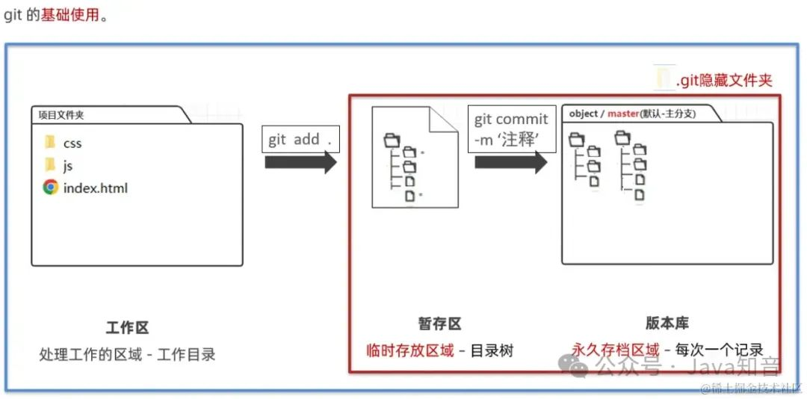
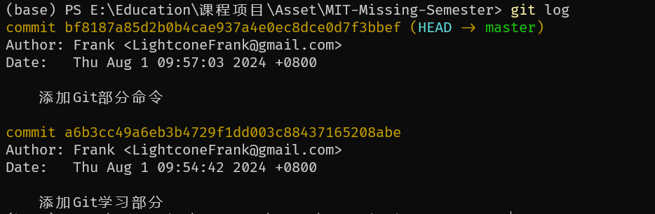
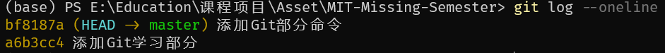

# MIT Missing Semester Notes
---
## 1. Shell
常用命令：
- `ls`：列出目录内容
  - `-l`：显示详细信息
- `cd`：切换目录
- `pwd`：显示当前目录
- `echo`：输出
- `cat`：查看文件内容
- `which`：查看命令位置
- `man`：查看命令手册
- `mkdir`：创建目录
- `$PATH`：(查看)环境变量
- `mv`：移动或重命名文件
- `cp`：复制文件

Shell中使用`/`表示目录，`~`表示家目录，`.`表示当前目录，`..`表示上级目录。
例如：
  - `cd ~/Dev`表示切换到`home`目录下的`Dev`文件夹。
  - `cd ../..`表示切换到上上级目录。
  - `cd -`表示切换到上次所在目录。

如果某个路径以`/`开头，表示绝对路径，否则表示相对路径。
如果不指定路径，程序默认执行当前路径，如`ls`，直接使用会输出当前目录下的文件。
通常情况下使用`-h`或`--help`可以查看命令（程序）的帮助信息。
```shell
lightcone@Lightcone:~$ ls /
bin   dev  home  lib    lib64   lost+found  mnt  proc  run   snap  sys  usr
boot  etc  init  lib32  libx32  media       opt  root  sbin  srv   tmp  var
lightcone@Lightcone:~$ ls / -l
total 2152
lrwxrwxrwx   1 root root       7 May  2  2023 bin -> usr/bin
drwxr-xr-x   2 root root    4096 Mar 10 17:31 boot
drwxr-xr-x  16 root root    3260 Jul 14 09:19 dev
drwxr-xr-x 137 root root   12288 Jul 14 09:20 etc
drwxr-xr-x   3 root root    4096 Dec  3  2023 home
-rwxrwxrwx   1 root root 2127224 Apr 26 02:17 init
lrwxrwxrwx   1 root root       7 May  2  2023 lib -> usr/lib
lrwxrwxrwx   1 root root       9 May  2  2023 lib32 -> usr/lib32
lrwxrwxrwx   1 root root       9 May  2  2023 lib64 -> usr/lib64
lrwxrwxrwx   1 root root      10 May  2  2023 libx32 -> usr/libx32
drwx------   2 root root   16384 Apr 11  2019 lost+found
drwxr-xr-x   2 root root    4096 May  2  2023 media
drwxr-xr-x   7 root root    4096 Jul 14 09:19 mnt
drwxr-xr-x   2 root root    4096 May  2  2023 opt
dr-xr-xr-x 361 root root       0 Jul 14 09:19 proc
drwx------   4 root root    4096 Mar 10 18:18 root
drwxr-xr-x  24 root root     640 Jul 14 09:20 run
lrwxrwxrwx   1 root root       8 May  2  2023 sbin -> usr/sbin
drwxr-xr-x   8 root root    4096 May  2  2023 snap
drwxr-xr-x   2 root root    4096 May  2  2023 srv
dr-xr-xr-x  11 root root       0 Jul 14 09:19 sys
drwxrwxrwt   9 root root    4096 Jul 14 09:19 tmp
drwxr-xr-x  14 root root    4096 May  2  2023 usr
drwxr-xr-x  14 root root    4096 Mar 10 17:32 var
lightcone@Lightcone:~$
```
上方代码中`d`代表是目录，`rwx`分别代表文件所有者、文件所属组、其他用户的权限。其中`r`表示读权限，`w`表示写权限，`x`表示执行权限。

**在程序间创建连接：**
在程序中主要有两个"流"，输入流和输出流。输入流是程序从外部获取数据，输出流是程序向外部输出数据。最简单的定向是使用`>`和`<`，`>`表示将输出流重定向到文件，`<`表示将输入流重定向到文件。
```shell
lightcone@Lightcone:~$ echo "Hello, World!" > hello.txt
lightcone@Lightcone:~$ cat hello.txt
Hello, World!
lightcone@Lightcone:~$ cat < hello.txt
Hello, World!
lightcone@Lightcone:~$
```
`>>`表示将输出流追加到文件，`2>`表示将错误流重定向到文件。
```shell
lightcone@Lightcone:~$ echo "Hello, World!" > hello.txt
lightcone@Lightcone:~$ echo "Hello, World!" >> hello.txt
lightcone@Lightcone:~$ cat hello.txt
Hello, World!
Hello, World!
lightcone@Lightcone:~$ ls /notexist 2> error.txt
lightcone@Lightcone:~$ cat error.txt
ls: cannot access '/notexist': No such file or directory
lightcone@Lightcone:~$
```
使用`|`可以将一个程序的输出流重定向到另一个程序的输入流。
```shell
lightcone@Lightcone:~/ShellLearning$ ls / | grep bin
bin
sbin
lightcone@Lightcone:~/ShellLearning$
```
`grep`是一个强大的文本搜索工具，可以使用正则表达式搜索文本。
上面这一句的意思是列出`/`目录下的文件，并将结果通过管道传递给`grep`，`grep`搜索包含`bin`的行。
还可以这样：
```shell
lightcone@Lightcone:~/ShellLearning$ ls / -l | tail -n1
drwxr-xr-x  14 root root    4096 Mar 10 17:32 var
lightcone@Lightcone:~/ShellLearning$
```
`tail`默认显示文件的最后10行，`-n`参数可以指定显示的行数。

root用户是Linux系统中的超级用户，拥有最高权限。但我们不应该总是以root用户的身份运行程序，因为这样会增加系统被攻击的风险。我们可以使用`sudo`命令来以root用户的身份运行程序。`sudo`是`do as superuser`的缩写，可以让普通用户以root用户的身份运行程序。
```shell
lightcone@Lightcone:~$ sudo ls /root
[sudo] password for lightcone:
ls: cannot open directory '/root': Permission denied
lightcone@Lightcone:~$
```

`tee`命令可以将输入流输出到文件，并将输入流传递给下一个程序。如果没有定向下一个程序，`tee`会将输入流输出到标准输出。
```shell
lightcone@Lightcone:~$ echo "Hello, World!" | tee hello.txt | cat
Hello, World!
lightcone@Lightcone:~$
```

---
## 课后习题·Shell
1. 在 /tmp 下新建一个名为 missing 的文件夹。
```shell
lightcone@Lightcone:~/ShellLearning$ mkdir tmp; cd ./tmp; mkdir missing
lightcone@Lightcone:~/ShellLearning/tmp$ ls
missing
lightcone@Lightcone:~/ShellLearning/tmp$
```
2. 用 man 查看程序 touch 的使用手册。
```shell
lightcone@Lightcone:~/ShellLearning man touch
```
3. 用 touch 在 missing 文件夹中新建一个叫 semester 的文件。
```shell
lightcone@Lightcone:~/ShellLearning/tmp$ touch missing/semester
lightcone@Lightcone:~/ShellLearning/tmp$ ls missing
semester
lightcone@Lightcone:~/ShellLearning/tmp$
```
4. 将以下内容一行一行地写入 semester 文件：
    ```shell
    #!/bin/sh
    curl --head --silent https://missing.csail.mit.edu
    ```
```shell
lightcone@Lightcone:~/ShellLearning/tmp/missing$ echo '#!/bin/sh' | tee semester
#!/bin/sh
lightcone@Lightcone:~/ShellLearning/tmp/missing$ echo 'curl --head --silent https://missing.csail.mit.edu' >> semester
lightcone@Lightcone:~/ShellLearning/tmp/missing$ cat semester
#!/bin/sh
curl --head --silent https://missing.csail.mit.edu
lightcone@Lightcone:~/ShellLearning/tmp/missing$
```

---
使用`$`可以访问变量，例如
```shell
lightcone@Lightcone:~$ a=Hello
lightcone@Lightcone:~$ echo $a
Hello
lightcone@Lightcone:~$
```
`$0`表示程序名，`$1`表示第一个参数，`$2`表示第二个参数，以此类推。`$#`表示参数个数，`$@`表示所有参数，`$*`表示所有参数，但是会将所有参数当作一个参数。

## 2. Git
Git是一个分布式版本控制系统，可以追踪文件的变化。
##### Git的三个区域：
- **工作区**：处理工作的区域
- **暂存区**：临时存放文件的区域
- **本地git仓库**：最终存放文件的区域

##### 在文件夹的体现如下：
- **工作区**：电脑中看到的目录
- **暂存区**：`.git`目录下的`index`文件（二进制文件）
- **版本库**：整个`.git`目录

##### Git配置：
- `git config --global user.name "Your Name"`：设置用户名
- `git config --global user.email "Your Email"`：设置邮箱
每一个Git提交都会记录这两个信息。

可以使用`git config --list`查看配置信息。

##### 文件右侧标记
使用VsCode打开包含Git仓库的文件夹，会有如下标记：
- `M`：文件被修改但还没有添加到暂存区
- `A`：文件已经添加到暂存区，但还没有提交
- 'D'：文件被删除但还没有提交
- 'R'：文件被重命名但还没有添加到暂存区
- 'C'：文件被复制但还没有添加到暂存区
- 'U'：文件有冲突，需要解决

#### Git基础命令
- `git init`：初始化一个Git仓库，会在当前目录下生成一个`.git`目录
##### 记录更新到Git仓库：
每当完成一个阶段的目标，想要记录下来，就可以将其提交到Git仓库。
核心操作:`工作区开发`-->`将修改后的文件添加到暂存区`-->`将暂存区的文件提交到本地Git仓库`
- `git add <file>`：将文件添加到暂存区
```shell
# 将 index.html 添加到暂存区
git add index.html
# 将css目录下的所有文件添加到暂存区
git add css/
# 将所有文件添加到暂存区
git add .
```
将暂存区内容提交到版本库：
- `git commit -m "message"`, `-m`后面的内容是提交的内容说明
过程如下：

以上命令相当于存档了一次，在版本库中产生一次提交记录并生成一个版本号。
存档不耽误工作，可以继续修改文件，然后再次存档。

##### Git日志及状态查看
查看所有提交的日志记录：
- `git log`
运行命令效果如下：

如果想查看最近一次提交的内容：
- `git show`
日志很多，想要简化查看：
- `git log --oneline`
